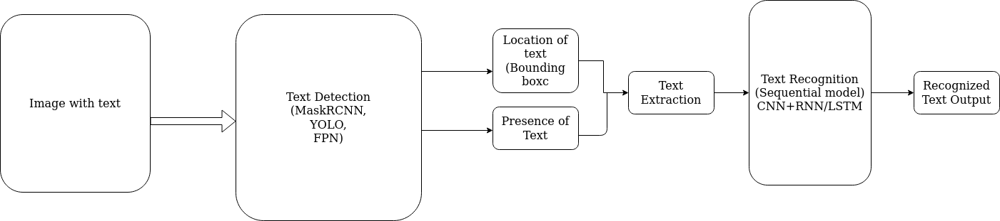

# devdristi
An OCR implementation for Devnagiri Text

---

# Problem Statement
To identify, recognize, isolate and convert devnagiri text from images to electronic characters

---

# Requirements:
1. Isolate texts from noise and blank space
2. Recognize devnagiri characters and match with corresponding codes
3. Convert full paragraphs and pages

---

# Steps:
1. Recognize and isolate alphabets using CNN (Segmentation)
2. Convert isolated text images to characters (Classification / LSTM)
3. Data Collection for training Devnagiri model
4. Annotate Collected Data
5. Isolate devnagiri text from images
6. Recognize individual characters
7. Recognize words & larger structures
8. Devnagiri Text Conversion

---

# Methodology:
---
A. Research Methodolgy
  - Primary Source (Photograph samples)
  - Secondary Sources (Newspapers, Websites)

B. Technologies Used
  - Pytorch
  - GitHub (Version Management)
  - CNN (CapsuleNet Future.)
  - Google Sheets (Documentation/Progress Tracking)

System Architecture

Popular object detection models can be used as text detector modules in above system architecture. The detected text images can be easily extracted with opencv (i.e we crop the text image), then feed into CNN+RNN architecture for recognizing the text sequence. For such recognition the cropped image may be divided into several slices of a window and fed sequentially in left to right direction into a LSTM which then predicts the text sequence. The predicted sequence may repeat characters thus must be fed into a CTC loss so that we predict a meaningful text output.

There are several datasets currently available for such text recognition as listed below:
- COCO
- ICADR
- SVHN url

The different text detectors will be implemented in different branches.
  
 # Contributors
  - Jikesh Thapa
  - Shovan Shrestha

